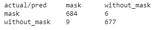
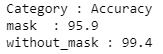

# Transfer Learning for Face-mask Classification using PyTorch
### This code is tested on PyTorch=0.4.1

## :+1: Download Data

You can download ***Mask Classifier*** dataset from [here](https://drive.google.com/open?id=1JkFqOaG5ucUviq5phZaoL66br2hEj-nH) and then save it into a folder name ```data/```

In this repo, I am going to apply transfer learning in two ways to classify the mask image.

## :+1: What is Treansfer Learning ?

In reality, very few people train the entire Convolutional Network from scratch (with random initialization) because it is fairly difficult to have a data set of adequate scale. Alternatively, it is popular to pre-train ConvNet on a very large dataset (e.g. ImageNet, which includes 1.2 million images with 1000 categories) and then use ConvNet either as an initialization or as a fixed feature extractor for the task of interest.

These two major transfer learning scenarios appear as follows: 

### :+1: Finetuning the convnet
Instead of random initialization, we initialise the network with a pre-trained network, like the one trained on the imageet 1000 dataset. The remainder of the preparation is as normal. 

### :+1: ConvNet as a fixed feature extractor
We freeze the weights for the entire network except for the final fully connected layer. This last fully connected layer is replaced by a new one with random weights and only this layer is trained.

### :+1: Results by Finetuning the convnet 

#### Classwise accuracy

### :+1: Results by ConvNet as a fixed feature extractor

#### Classwise accuracy


## Sample images

